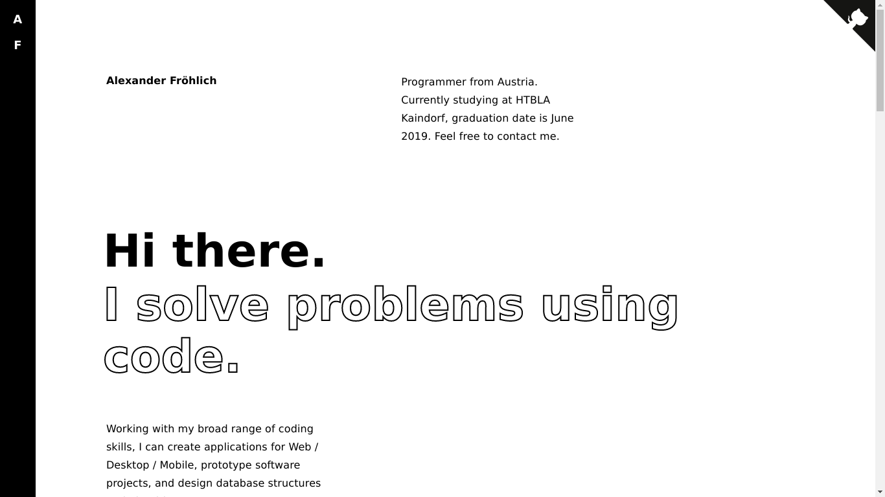

# [alexanderfroehlich.me](https://alexanderfroehlich.me)
> Alexander Fröhlich's online portfolio and CV

## Development
This website was developed using the framework [GatsbyJS](https://www.gatsbyjs.org/), a static site generator, which itself uses technologies such as [React](https://reactjs.org/) and [GraphQL](https://graphql.org/). GatsbyJS uses all the advantages of React, such as components and declarative views, while adding features only static sites can provide, like incredibly fast load times and an increased SEO.

The website is hosted on [Netlify](https://www.netlify.com/), a static hosting provider that automatically manages deployment, continuous integration, and HTTPS.

## UX
To create a visual identity and leave a lasting impression, the website only uses simple styling in the colors black & white instead of a Bootstrap or Material framework. The website is optimised for reading on desktop, tablet, and mobile displays. Fonts used are Arial and the system-default sans-serif to minimize load times, and all images are lazy-loaded & automatically scaled up and down according to the window size.